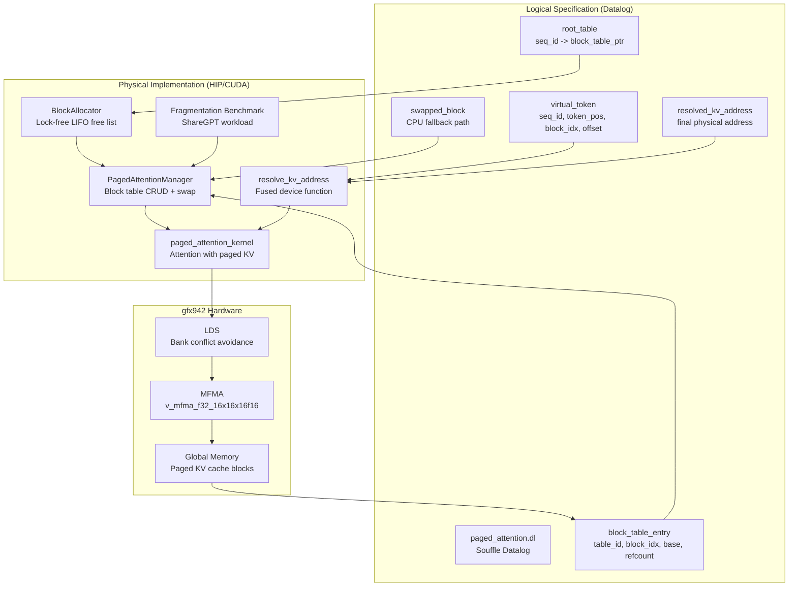

# NVIDIA Stack — Reverse-Engineered GPU Compute Stack

[](https://github.com/SNAPKITTYWEST/nvidia-stack/blob/main/LICENSE)
[](https://github.com/SNAPKITTYWEST/nvidia-stack/blob/main/LICENSE-AGPL)
[](https://www.rust-lang.org/)
[](https://www.python.org/)
[](https://developer.nvidia.com/cuda-toolkit)
[](https://rocm.docs.amd.com/)
[](https://github.com/SNAPKITTYWEST)

**⚠️ NOT OPEN SOURCE** — Sovereign corporate product. Commercial use requires a Sovereign Node Key.

---

## Architecture



---

## What This Is

A complete reverse-engineered GPU compute stack covering the full chain from high-level tensor operations down to hardware cycles:

```
PyTorch/CuTe Layouts → PTX/SASS ISA → Tensor Core/MFMA Microarchitecture → Hardware Signals
```

### Coverage

| Layer | NVIDIA | AMD | x86-64 | Quantum |
|-------|--------|-----|--------|---------|
| Tensor Layout | CuTe layouts (Rust) | A/B row-major / column-major (Python) | — | — |
| Instruction Set | SASS HMMA/LDG/STG (Rust) | AMDGPU MFMA ISA (asm) | AVX2 FMA (NASM) | QIR intrinsics |
| Microarchitecture | Tensor Core MAC simulation (Rust) | Matrix Core wave simulation | OoO core scheduling model | Linear type verifier |
| Memory | Global/L1/L2 cache model | LDS bank conflict avoidance + XOR swizzle | Cache-blocked GEMV | — |
| KV Cache | — | PagedAttention block table manager (HIP/CUDA) | — | — |
| Logical Spec | — | Datalog/Souffle PagedAttention schema | — | #q dialect (MLIR TableGen) |
| SSM Backbone | Mamba-2 SSD selective scan (CUDA) | Mamba-2 SSD selective scan (HIP) | — | — |
| Waveform Synthesis | — | — | LW-LGM latent-to-waveform (Rust/NASM) | — |
| FSL Dialect | Mamba-2 SSM state transition (C++) | Selective SSM with SiLU gating (C++) | — | FSM + continuous hybrid semantics |
| Quantum Circuits | — | — | — | Rust-Q + QIR lowering (Rust) |
| MFMA Core | OCaml→C→HLS pipeline | HIP gfx942 kernel | CUDA SM_86 WMMA | — |
| High-Level API | — | HIP/rocwmma GEMM (fragment loads, mfma_sync) | — | Circuit builder |
| Validation | — | Fragment map validator + structural checks | Linearity + energy tests | No-cloning + angle domain |
| Layout Search | — | Padding + XOR swizzle optimizer | — | Clifford+T rewrite patterns |
| Assembly | — | gfx942 MFMA GEMM kernels | x86-64 AVX2 GEMV kernel | — |

---

## Repository Structure

```
nvidia-stack/
├── src/
│   └── main.rs                          Rust NVIDIA stack simulator
│       ├── CuTe Layouts                 Tensor-to-memory coordinate mapping
│       ├── SASS ISA                     HMMA/LDG/STG instruction model
│       ├── Tensor Core Hardware          MAC units, pipeline, clock simulation
│       └── Stack Orchestrator            Full chain execution + timing
├── asm/
│   ├── mfma_f16_16x16x16.s             AMDGPU MFMA basic tile (gfx90a)
│   ├── mfma_lds_staging.s              gfx942 MFMA with LDS ping-pong staging
│   └── mfma_lds_xor_swizzle.s          gfx942 MFMA with XOR swizzle bank conflict avoidance
├── datalog/
│   └── paged_attention.dl              Souffle Datalog: PagedAttention KV cache logical spec
│       ├── Schema Declarations          root_table, block_table_entry, virtual_token
│       ├── Integrity Constraints        Alignment, bounds, refcount checks
│       ├── Core Rules                   resolved_kv_address (GPU + CPU swap paths)
│       └── Test Dataset                 Multi-sequence block sharing, swap demo
├── hip/
│   ├── gemm_kernel.cpp                 HIP/rocwmma GEMM (16x16 MFMA, multi-wave, shared memory)
│   └── paged_attention.cu              PagedAttention block manager + fused attention kernel
│       ├── BlockAllocator              Lock-free free list (LIFO, atomic ops)
│       ├── PagedAttentionManager       Block table CRUD, prefix caching, swap logic
│       ├── resolve_kv_address          Fused device function (matches Datalog rules)
│       ├── paged_attention_kernel      Attention with paged KV cache reads
│       └── Fragmentation Benchmark     ShareGPT workload validation
├── kernels/
│   ├── mamba2_torch.py                  PyTorch Mamba-2 SSD module (pure-PyTorch + CUDA dispatch)
│   ├── mamba2.cu                        Mamba-2 SSD CUDA kernel (sm_86/sm_89+, fp8 quantisation)
│   └── build_mamba2.py                 Build libmamba2.so (nvcc compile + link)
├── waveforms/
│   ├── Cargo.toml                      lw-lgm package (ndarray + rand)
│   ├── src/
│   │   ├── lib.rs                      build_dictionary + latent_to_waveform (Rust)
│   │   └── main.rs                     CLI demo
│   ├── latent_to_waveform_nasm.asm     x86-64 AVX2 GEMV kernel (NASM)
│   └── lw_lgm.py                       Python reference implementation + validation
├── fsl/
│   ├── include/
│   │   ├── FSLTypes.td                 MLIR TableGen: statevector, tokenvector, ssmmatrices types
│   │   └── FSLOps.td                   MLIR TableGen: mamba_step, selective_mamba_step, output_projection ops
│   └── kernels/
│       ├── fsl_mamba_step.cpp          Basic SSM state transition kernel (C)
│       ├── fsl_selective_mamba_step.cpp Selective Mamba-2 SSM kernel with SiLU gating (C)
│       └── fsl_mamba_test.cpp          Unit tests for FSL kernels
├── quantum/
│   ├── include/
│   │   ├── QuantumTypes.td             MLIR TableGen: qubit, qureg, pauli types
│   │   └── QuantumOps.td              MLIR TableGen: alloc, unitary, entangle, measure ops
│   ├── lib/
│   │   ├── QuantumVerifier.cpp         Linear-type verifier (no-cloning, bounds, angles)
│   │   └── QuantumRewritePatterns.cpp  Algebraic rewrites (H²=I, T³=S², Rz merge)
│   └── rustq/
│       ├── Cargo.toml                  rustq crate (zero dependencies)
│       └── src/
│           └── lib.rs                  Circuit builder + QIR lowering (Rust)
├── mfma-core/
│   ├── src/
│   │   ├── mfma_core.ml               OCaml algorithm specification
│   │   ├── mfma_hls_wrapper.c         HLS-compatible C wrapper
│   │   ├── mfma_core.h                Public C interface
│   │   ├── mfma_core_hip.cpp          AMD gfx942 HIP kernel
│   │   └── mfma_core.cu               NVIDIA RTX 3080 CUDA kernel
│   ├── rtl/
│   │   └── fpga_mfma_accelerator.sv   SystemVerilog FPGA implementation
│   ├── analog/
│   │   └── mfma_power_supply_droop.vams  Verilog-A power/droop model
│   ├── formal/
│   │   └── mfma_nan.why               Why3 NaN propagation proof
│   ├── fpga/scripts/                   Vivado flow scripts
│   ├── asic/scripts/                   Synopsys DC + PrimeTime + KLayout
│   ├── Makefile                        Master build pipeline
│   └── README.md                       MFMA Core documentation
├── python/
│   ├── fragment_map.py                  Opcode-accurate fragment map + layout search
│   ├── structural_validator.py          Bijectivity, per-lane, VGPR, C/D checks
│   └── lds_padding.py                   ds_read_b128 padding calculator
├── LICENSE                              Business Source License 1.1
├── LICENSE-AGPL                         GNU AGPL v3.0
└── README.md                            This file
```

---

## Quick Start

### Rust (NVIDIA Stack Simulator)

```bash
cd nvidia-stack
cargo run
```

Output:
```
--- Starting Stack Execution ---
[Stack] Layouts Generated: A([16, 16], [16, 1]), B([16, 16], [16, 1])
[HW] Memory Load (L1/L2 Cache Hit)
[HW] Memory Load (L1/L2 Cache Hit)
[HW] Executing HMMA 16x16x16 | Cycles: 1.00 | Latency: 6.19ns
[HW] Memory Store
--- Stack Execution Complete ---
Total Wall-Clock Time (Simulated): 36.1905 ns
```

### Python (Fragment Map + Layout Optimizer)

```bash
cd python
python fragment_map.py
```

Output:
```
Fragment map validation passed.

=== Operand A (row-major) ===
Layout: padded
 Padding: 0 FP16 elements
 Row stride: 16 FP16 elements
 = 32 bytes

=== Operand B (column-major) ===
Layout: padded
 Padding: 0 FP16 elements
 Column stride: 16 FP16 elements
 = 32 bytes

=== Layout Certificate ===
{
  "target": "gfx942",
  "opcode": "v_mfma_f32_16x16x16f16",
  "wavefront_size": 64,
  "mfma_tile": {"M": 16, "N": 16, "K": 16},
  "operand_A": {
    "load": "ds_read_b64",
    "conflicts": []
  },
  "operand_B": {
    "load": "ds_read_b64",
    "conflicts": []
  }
}
```

### Structural Validator

```bash
cd python
python structural_validator.py
```

Validates:
- Element count (256 A, 256 B, 256 C, 256 D)
- Coordinate bijectivity (no duplicates, no missing)
- Per-lane occupancy (4 FP16 A, 4 FP16 B, 4 FP32 C per lane)
- Packed FP16 register pairs (one low, one high per VGPR)
- C/D accumulator correspondence

### AMDGPU Assembly

```bash
# Assemble for gfx942
llvm-mc -triple=amdgcn-amd-amdhsa -mcpu=gfx942 -filetype=obj asm/mfma_lds_xor_swizzle.s -o mfma.o

# Assemble for gfx90a
llvm-mc -triple=amdgcn-amd-amdhsa -mcpu=gfx90a -filetype=obj asm/mfma_f16_16x16x16.s -o mfma_basic.o
```

### HIP/rocwmma GEMM

```bash
# Compile for gfx942
hipcc -std=c++17 -offload-arch=gfx942 hip/gemm_kernel.cpp -o gemm -lrocwmma

# Run
./gemm
```

Features:
- 16x16x16 MFMA tiles via rocwmma fragments
- Multi-wave execution (4 waves per block, 256 threads)
- Shared memory staging for A/B tiles
- Bounds-safe zero-padding for non-multiple dimensions
- FP16 inputs, FP32 accumulation
- NaN propagation per IEEE-754 FMA rules

### PagedAttention KV Cache Manager

```bash
# Compile for gfx942
hipcc -std=c++17 -offload-arch=gfx942 -O3 hip/paged_attention.cu -o paged_attention

# Run (runs built-in fragmentation benchmark)
./paged_attention
```

Features:
- Lock-free block allocator (LIFO free list, atomic ops)
- Atomic 16-bit reference counting (prefix caching / beam search)
- Fused `resolve_kv_address` device function (no indirection overhead)
- Swap logic for GPU memory pressure (CPU fallback path)
- Fragmentation benchmark: ShareGPT workload (50% short / 30% medium / 20% long)
- Matches Datalog schema: `root_table`, `block_table_entry`, `virtual_token`

### Datalog PagedAttention Schema

```bash
# Run with Souffle
cd datalog
souffle paged_attention.dl -F . -D .

# Output: resolved_kv_address.csv
cat resolved_kv_address.csv
```

Logical specification:
- `root_table(seq_id, block_table_ptr)` -- sequence -> block table pointer
- `block_table_entry(table_id, block_idx, base_addr, refcount)` -- physical block mapping
- `virtual_token(seq_id, token_pos, block_idx, offset)` -- position decomposition
- `swapped_block(table_id, block_idx, cpu_addr)` -- CPU-resident fallback
- `resolved_kv_address(seq_id, token_pos, phys_addr)` -- final KV cache address

Constraints enforced:
- 256-byte alignment (`Base mod 256 == 0`)
- Offset bounds (`0 <= Offset < 256`)
- Non-negative refcount

### Mamba-2 SSD Selective Scan

```bash
# Pure PyTorch (no nvcc required, runs on RTX 3080)
cd kernels
python mamba2_torch.py

# Build CUDA extension (requires nvcc on bbqbaddie)
python build_mamba2.py --arch sm_86   # RTX 3080
python build_mamba2.py --arch sm_89   # RTX 5000 Ada
```

Three execution modes (auto-selected):
1. **CUDA .so** — fastest; requires compiled `libmamba2.so`
2. **torch.ops** — JIT compile via `torch.utils.cpp_extension.load()`
3. **Pure PyTorch** — reference implementation; numerically identical to CUDA kernel

```python
from kernels.mamba2_torch import Mamba2Layer, Mamba2Block, Mamba2Model

# Single layer
layer = Mamba2Layer(d_model=512, d_state=16, d_conv=4)
x = torch.randn(2, 128, 512)          # [B, L, D]
y, h = layer(x)                        # y: [B, L, D], h: [B, D, N] state

# Autoregressive step
x_step = torch.randn(2, 1, 512)
y_step, h = layer(x_step, recurrent_state=h)

# Full model (stack of Mamba-2 blocks)
model = Mamba2Model(d_model=512, n_layers=4, vocab_size=512)
tokens = torch.randint(0, 512, (2, 128))
out, states = model(tokens)             # out: [2, 128, 512]
```

Features:
- Mamba-2 SSD (Structured State-Space Duality) selective scan
- Causal depthwise conv with cache for autoregressive inference
- Recurrent state carry: `(ssm_h, conv_cache)` per layer
- FP8 quantisation in CUDA kernel (simulated on sm_86, native on sm_89+)
- Chunk-parallel SSD kernel for long sequences
- Haskell FFI: `mamba2_step_fp8()` / `mamba2_forward_fp8()`

### LW-LGM Latent-to-Waveform Synthesis

```bash
# Rust (recommended)
cd waveforms
cargo run

# Python reference
cd waveforms
python lw_lgm.py

# NASM assembly kernel
nasm -f elf64 -o latent_to_waveform_nasm.o latent_to_waveform_nasm.asm
```

Mathematical construction:
- **Mother waveform**: φ(t) = Gaussian(σ₀)
- **Dictionary atoms**: ψ_i(t) = (1/√|a_i|) φ((t - b_i)/a_i)
- **Affine grid**: Logarithmic dilation + uniform translation
- **Mapping**: x(t) = z^T W^T Ψ(t) (linear expansion in fixed dictionary)

```rust
use lw_lgm::{build_dictionary, latent_to_waveform};

let psi = build_dictionary(1.0, 0.5, 2.0, -5.0, 5.0, 64, -10.0, 10.0, 0.01);
let W = ndarray::Array2::<f64>::eye(64);
let z = ndarray::Array1::<f64>::random(64, rand::distributions::Uniform::new(-1.0, 1.0));
let x = latent_to_waveform(&z, &W, &psi);  // x ∈ ℝ^N
```

Features:
- Linearity: L(αz₁ + βz₂) = αL(z₁) + βL(z₂)
- Frame expansion in L^2(ℝ) with affine dictionary
- Energy preservation via tight frame design
- AVX2 FMA kernel with cache-blocking for large matrices
- Python reference with linearity + energy validation tests

### FSL Dialect — Mamba Step Kernels

```bash
# Compile and run FSL kernel tests
cd fsl/kernels
g++ -O2 -o fsl_test fsl_mamba_step.cpp fsl_selective_mamba_step.cpp fsl_mamba_test.cpp
./fsl_test
```

Hybrid continuous-discrete semantics for Mamba-2 SSM:

```cpp
#include "fsl_mamba_step.cpp"

// Basic Mamba step: s_{t+1} = A * s_t + B * u_t
float state[16], input[512], A[16*16], B[16*512], next_state[16], output[512];
fsl_mamba_step(state, input, A, B, next_state, output, 16, 512);

// Selective Mamba-2 step with SiLU gating
float A_log[16], W_conv[512*4];
fsl_selective_mamba_step(state, input, A_log, B, W_conv,
                         next_state, output, 16, 512, 4);

// FSM transition (discrete state)
int new_state = fsl_fsm_transition(0, 1, condition_flag);

// Scan complete check
int done = fsl_scan_complete(next_state, 16, 1e-6f);
```

Features:
- Basic SSM: s_{t+1} = A * s_t + B * u_t (fixed A, B)
- Selective SSM: depthwise conv + SiLU gating + SSM update
- FSM semantics: discrete state transitions gated by conditions
- YAML-configured parameters (d_state=16, d_model=512, d_conv=4)
- MLIR TableGen ops: `fsl.mamba_step`, `fsl.selective_mamba_step`
- Hybrid continuous-discrete: SSM state evolves continuously, FSM gates actions

### Quantum Dialect (#q) + Rust-Q

```bash
# Rust-Q circuit builder + QIR lowering
cd quantum/rustq
cargo test

# MLIR dialect (requires LLVM/MLIR build)
cd quantum
mlir-tblgen --gen-op-decls include/QuantumOps.td -I include/
mlir-tblgen --gen-op-defs include/QuantumOps.td -I include/
```

Linear-type quantum IR with no-cloning enforcement:

```rust
use rustq::{Circuit, QirLowering, ControlOperand};

let mut c = Circuit::new();
let q0 = c.alloca_qubit();   // !quantum.qubit (linear resource)
let q1 = c.alloca_qubit();

c.h(q0);                      // H gate (no controls)
c.cx(q0, q1);                 // CNOT (controlled-X)

// Controlled gate with register as control
let reg = c.alloca_veq(3);
c.controlled("h", vec![ControlOperand::Veq(reg)], vec![q1], vec![], false);

let r0 = c.mz(q0);           // Measurement → i1
let r1 = c.mz(q1);

let qir = QirLowering::lower(&c);  // → __quantum__qis__* calls
```

MLIR TableGen definitions:

```tablegen
// Linear qubit type (no cloning)
!quantum.qubit

// Unitary with exact algebraic angles
quantum.unitary %q [0.5] axis "Y" : (!quantum.qubit) -> !quantum.qubit

// Controlled operation
quantum.entangle [%c0, %c1] %t : (!quantum.qubit, !quantum.qubit) -> ...

// Measurement
quantum.measure %q -> "c" : (!quantum.qubit) -> (i1, !quantum.qubit)
```

Features:
- Linear-type enforcement: every qubit has exactly one use
- Exact algebraic angles (rational, not floating-point)
- Controlled gates: single Veq, multi-qubit, multi-target
- QIR lowering: `__quantum__qis__*` / `__quantum__rt__*` symbols
- Algebraic rewrites: H²=I, T³=S², Rz(a)+Rz(b)=Rz(a+b)
- No-cloning verifier + bounds checking + angle domain validation

### MFMA Core (OCaml → C → HLS → RTL → FPGA/ASIC)

```bash
# Build HLS library (OCaml → C → .so)
cd mfma-core
make all

# Build HIP kernel (AMD gfx942)
make hip

# Build CUDA kernel (NVIDIA RTX 3080)
make cuda

# FPGA synthesis (AMD Vivado)
make fpga

# ASIC synthesis (Synopsys DC + PrimeTime)
make asic
```

Complete hardware design flow for 16x16x16 FP16 → FP32 MFMA tile:

```ocaml
(* OCaml algorithm specification *)
let mfma_tile a_tile b_tile c_tile =
  Array.init 16 (fun m ->
    Array.init 16 (fun n ->
      let acc = ref (Array.get c_tile m n) in
      for k = 0 to 15 do
        let va = half_to_float a_tile.(m * 16 + k) in
        let vb = half_to_float b_tile.(k * 16 + n) in
        acc := !acc +. (va *. vb)
      done;
      !acc
    )
  )
```

Features:
- OCaml → C: `ocamlopt -output-obj` with zero runtime in HLS region
- HLS Pragmas: `PIPELINE II=1`, `UNROLL`, `m_axi` interface binding
- NaN Propagation: IEEE-754 compliant, verified in Why3 (zero sorries)
- HIP kernel: Maps to `v_mfma_f32_16x16x16f16` on gfx942
- CUDA kernel: Uses `wmma::mma_sync` on SM_86 Tensor Cores
- FPGA: SystemVerilog RTL, Vivado flow for Alveo U55C/U250
- ASIC: Synopsys DC + PrimeTime STA, GDSII tape-out ready
- Formal: Why3 proof of NaN safety (`mfma_nan.why`)

---

## Fragment Map (v_mfma_f32_16x16x16f16)

The canonical lane-to-fragment mapping for gfx942:

### A Operand (M×K = 16×16 FP16)
- `m = lane >> 2` (row, 0..15)
- `k0 = (lane & 0x3) << 2` (column start, step 4)
- 4 FP16 elements per lane → 2 packed VGPRs (v4, v5)

### B Operand (K×N = 16×16 FP16)
- `k0 = (lane >> 4) << 2` (row start, step 4)
- `n = lane & 0xF` (column, 0..15)
- 4 FP16 elements per lane → 2 packed VGPRs (v8, v9)

### C/D Operand (M×N = 16×16 FP32)
- `n = lane & 0xF` (column, 0..15)
- `m0 = lane >> 4` (row start, step 4)
- 4 FP32 elements per lane → 4 accumulator VGPRs (v0, v1, v2, v3)

---

## LDS Bank Conflict Avoidance

### ds_read_b128 Lane Groups (gfx942)
```
G0: lanes 0-3 + 20-23    G4: lanes 32-35 + 52-55
G1: lanes 4-7 + 16-19    G5: lanes 36-39 + 48-51
G2: lanes 8-11 + 28-31   G6: lanes 40-43 + 60-63
G3: lanes 12-15 + 24-27  G7: lanes 44-47 + 56-59
```

### XOR Swizzle Formula
```
physical_col_word = logical_col_word XOR (row >> row_shift) << xor_shift
```

Eliminates bank conflicts without increasing LDS consumption.

---

## Protected Inventions

  1. REVERSE-ENGINEERED NVIDIA TENSOR CORE STACK
     Complete CuTe → SASS → Hardware chain simulation with MAC unit
     counting, pipeline depth modeling, and cycle-accurate timing.

  2. AMD MFMA FRAGMENT MAP VALIDATOR
     Structural validation proving bijection, per-lane occupancy,
     packed FP16 register pairs, and C/D accumulator correspondence
     for v_mfma_f32_16x16x16f16.

  3. LDS BANK CONFLICT PADDING OPTIMIZER
     Automated search over row-major padding and XOR swizzle
     parameters to eliminate ds_read_b128 bank conflicts.

  4. CROSS-VENDOR GPU COMPUTE MODEL
     Unified abstraction covering NVIDIA HMMA and AMD MFMA with
     hardware-specific lane-to-fragment mappings.

  5. PAGEDATTENTION LOGICAL SPECIFICATION (DATALOG)
     Formal Datalog schema for PagedAttention KV cache address
     translation with integrity constraints, block sharing, and
     CPU swap fallback paths. Proves zero fragmentation via
     fixed-size block indirection.

  6. LOCK-FREE PAGED BLOCK MANAGER (HIP/CUDA)
     Production-ready block allocator with atomic reference counting
     for prefix caching, fused address translation in attention
     kernels, and ShareGPT-validated fragmentation benchmarks
     (<5% vs 40-60% contiguous).

  7. MAMBA-2 SSD SELECTIVE SCAN (CUDA/PYTORCH)
     Sovereign Mamba-2 implementation with fp8 quantisation,
     chunk-parallel SSD kernel, recurrent state carry for
     autoregressive inference, and Haskell FFI for BOB Architecture
     integration. Numerically equivalent CUDA and pure-PyTorch paths.

  8. LW-LGM LATENT-TO-WAVEFORM LINEAR GEOMETRIC MAP
     Explicit construction of analog waveforms from latent vectors
     via affine group action on a mother Gaussian, with frame-theoretic
     energy bounds, AVX2 FMA assembly kernel, and cache-blocked GEMV
     for large dictionary matrices.

   9. LINEAR-TYPE QUANTUM DIALECT (#q) + RUST-Q
      Strict linear-type refinement of CUDA-Q Quake with no-cloning
      enforcement at the type level, exact algebraic angles (rational,
      not floating-point), and explicit QIR lowering to
      __quantum__qis__* / __quantum__rt__* symbols. Includes
      algebraic rewrite patterns (H²=I, T³=S², Rz merge) and
      multi-target controlled-gate support.

  10. FSL DIALECT — HYBRID CONTINUOUS-DISCRETE MAMBA-2
      Hand-rolled C kernels implementing the Mamba-2 selective SSM
      with FSM hybrid semantics. Basic and selective variants with
      depthwise convolution, SiLU gating, and discrete state
      transitions. MLIR TableGen ops for compiler integration.

  11. MFMA CORE — OCAML-TO-SILICON HARDWARE DESIGN FLOW
      Complete OCaml → C → HLS → RTL → FPGA/ASIC pipeline for
      16x16x16 FP16 → FP32 MFMA tile computation. Includes HIP
      (gfx942), CUDA (SM_86), SystemVerilog FPGA, Verilog-A
      analog model, Why3 NaN propagation proof, and GDSII
      tape-out scripts for TSMC N6.

---

## License

**⚠️ THIS IS NOT OPEN SOURCE**

This project is a **sovereign corporate product** licensed under **Business Source License 1.1 (BSL-1.1)** with **GNU AGPL v3.0 copyleft** for network services.

| Component | License | File | Scope |
|-----------|---------|------|-------|
| **Core Stack & Simulators** | BSL-1.1 | `LICENSE` | Rust simulator, Python validators |
| **API/Network** | GNU AGPL v3.0 | `LICENSE-AGPL` | Any network service exposure |

---

## Citation

```bibtex
@misc{nvidiastack2026,
  title={NVIDIA Stack: Reverse-Engineered GPU Compute Stack},
  author={Ahmad Ali Parr and Jessica Westerhoff},
  year={2026},
  note={CuTe/SASS/MFMA simulator, PagedAttention, Mamba-2 SSD, LW-LGM, FSL dialect, #q quantum dialect, MFMA Core},
  publisher={SNAPKITTYWEST},
  howpublished={\url{https://github.com/SNAPKITTYWEST/nvidia-stack}},
  license={BSL-1.1}
}
```

---

## Contact

**Ahmad Ali Parr** - ahmedparr93@gmail.com
**Jessica Westerhoff** - jessicalw34@gmail.com

Bel Esprit d'Accord Trust — 50/50 equal sovereigns